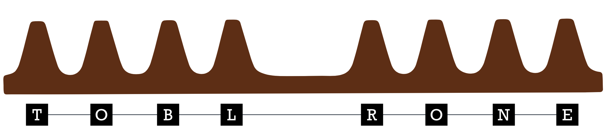
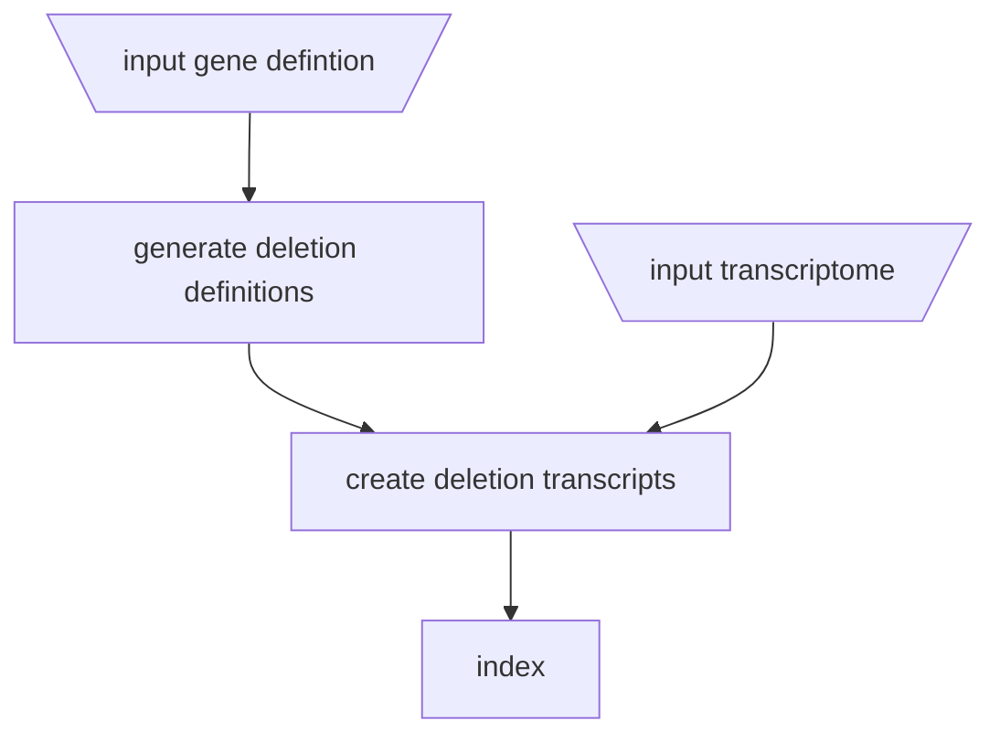
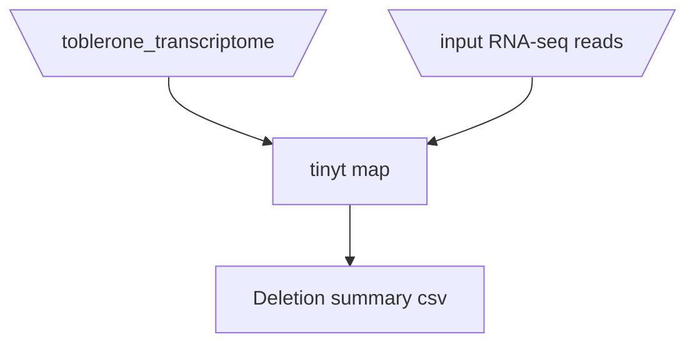
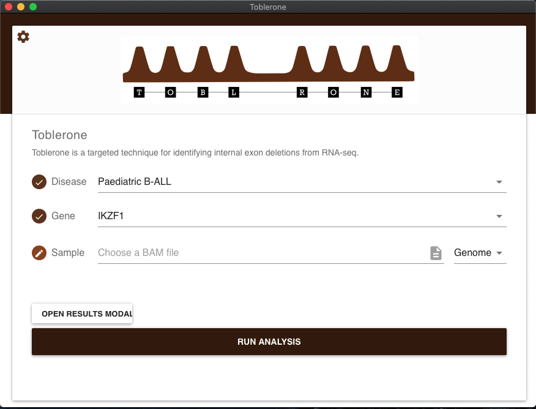

# Toblerone

Toblerone is a method for detecting exon deltions in RNA-seq data. You'll notice in the logo that an e(xon) is missing!

It is currently in development, extending the methods described here for acute lymphoblastic leukemia (ALL) focal deletions in IKAROS family zinc finger 1 (IKZF1) : https://github.com/Oshlack/ALL-RNAseq-utility-paper.  Toblerone looks for internal exon (not first or last) deletions. 

Toblerone consists of two key concepts: a specialised transcriptome and a modified pseudoalignment algorithm

A desktop app is also available for single sample analysis.


## Pseudoaligner

The psuedaligner core is currently called `tinyt` and can be run in standalone mode form the command line, or is inclued in the Toblerone app (see below).

```
tinyt

Usage:
  tinyt index [--num-threads=<n>] -i <index> <ref-fasta>
  tinyt map [--num-threads=<n>] [--read-length=<r>][--trim-size=<t>] [--skip-trim] [--output=<file>] -i <index> <reads-fastq> [<reads-pair-fastq>]
  tinyt -h | --help | -v | --version

Options:
  -n --num-threads N  Number of worker threads [default: 2]
  -t --trim-size T    Size of base pairs to trim when checking unique read matches [default: 2]
  -s --skip-trim      Skip the trim read check for unqiue read matches
  -r --read-length R  Provide read length for depth estimation
  -o --output FILE    Output results to file instead of stdout
  -h --help           Show this screen.
  -v --version        Show version.
```

#### Index

For a candidate gene, e.g. IKZF1, we take the the canonical transcript and generate a specialized transcriptome reference that consists of the original transcript plus deletion transcripts. Deletion transcripts consist of combinations of continuous exon deletion, excluding edge exons (first and last) exons. For N exons, (N-1 choose 2) additional deletion transcripts created.




#####  Generate transcripts

For the gene(s) of interest, a canonical transcript should be provided which is the full length in order for the maximum number of exon deletions to be captured. Currently only `BED12` file format is accepted.   

```
python scripts/make_bedfiles.py input.BED12 temp_output_dir 
```

Merge all the egenreted BED files into one:

```
find temp_output_dir  -name "*.bed"  -type f -exec cat {} + > combined.BED12
```

The canonical transcripts corresponding to the `BED12` files  must also be provided, and then `bedtools` can be used to generate the `toblerone_transcriptome`:

```
bedtools getfasta -fi input_transcriptome -bed combined.BED12 -split -name > toblerone_transcriptome
```

The `toblerone_transcriptome` can now be indexed for further mapping.

##### Create index

The `index` subcommand is run, using a convention of a `.tidx` for the `toblerone index` output.

```
tinyt index -i toblerone_transcriptome.tidx  toblerone_transcriptome 
```

#### Map

Reads can now be mapped and the counts, proportions and scaled proportions of deletions in a sample can now be calculated:





```
tinyt map  -i toblerone_transcriptome.tidx <reads>  
```

and `stdout` or a named output file will provide the per deletion trasncript information:

```
Gene, Deletion,Count,Total, GeneLength, ReadLength, Scale Factor,Proportion,Scaled Proportion
```


#### Code & License

This pseudoalignment implementation is based on the 10X Genomics Pseudoaligner code (https://github.com/10XGenomics/rust-pseudoaligner/), which itself draws on the concepts from Kalisto(), Salmon() and others. It is released under the MIT license in line with the template source. It is heavily modified for a Toblerone index, and not intended for general transcriptomes.  

## Install

TODO

### Source


### Binary

## App

TBC




# Roadmap

- [ ] Move transcriptome generation script into core 
- [ ] Rebuild original `bpipe` pipeline for transcript creation

# Acknowledgements 


